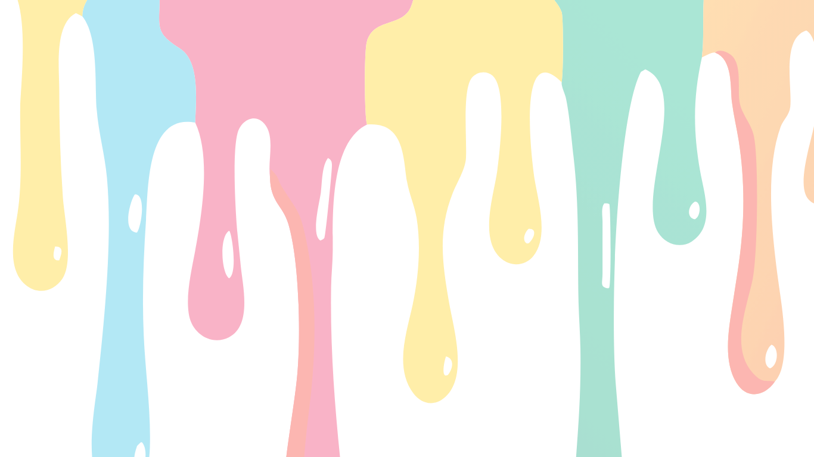

# 8Arts - Artist Portfolio Website

A modern, responsive artist portfolio website showcasing the work of Somya, a passionate artist specializing in oil paintings, acrylic works, and mixed media pieces.

## 🌟 Live Demo

Visit the live website: [8Arts Portfolio](https://your-username.github.io/8arts-website)

## 📸 Preview



## ✨ Features

### 🎨 **Complete Portfolio Showcase**
- **Hero Section**: Personal introduction with artistic quote
- **Gallery Preview**: Featured artwork with elegant presentation
- **About Section**: Artist biography and personal story
- **Background Section**: Education and professional experience
- **Project Gallery**: Project images and creative works
- **Photo Gallery**: Personal and behind-the-scenes photos
- **Testimonials**: Client reviews and feedback
- **Contact Section**: Easy ways to get in touch

### 🖼️ **Portfolio Gallery**
- **6 Featured Paintings**: Each with detailed descriptions
- **Scrollable Layout**: One painting per view for maximum impact
- **Painting Details**: Title, medium, year, and artistic description
- **Responsive Design**: Perfect on all devices

### 🛠️ **Technical Features**
- **Modular Architecture**: Easy to maintain and update
- **Responsive Design**: Works perfectly on desktop, tablet, and mobile
- **Fast Loading**: Optimized for performance
- **SEO Ready**: Proper meta tags and structure
- **Cross-Browser Compatible**: Works on all modern browsers

## 🚀 Quick Start

### Local Development
1. **Clone the repository**:
   ```bash
   git clone https://github.com/your-username/8arts-website.git
   cd 8arts-website
   ```

2. **Start a local server**:
   ```bash
   python3 -m http.server 8000
   ```

3. **Open your browser** and visit `http://localhost:8000`

### Deployment Options

#### GitHub Pages (Free)
1. Fork this repository
2. Go to Settings → Pages
3. Select "Deploy from a branch" → main
4. Your site will be live at `https://your-username.github.io/8arts-website`

#### Netlify (Free)
1. Drag and drop the project folder to [Netlify](https://netlify.com)
2. Your site will be live instantly with a custom URL

#### Vercel (Free)
1. Connect your GitHub repository to [Vercel](https://vercel.com)
2. Deploy with one click

## 📁 Project Structure

```
8arts-website/
├── index.html                 # Main landing page
├── portfolio.html            # Portfolio gallery page
├── styles.css               # Complete styling
├── js/
│   └── include.js           # Modular section loading
├── sections/                # Individual page sections
│   ├── hero.html            # Hero section with navigation
│   ├── gallery-preview.html # Featured artwork preview
│   ├── about.html           # About the artist
│   ├── background.html      # Education and experience
│   ├── project-gallery.html # Project showcase
│   ├── photo-gallery.html   # Photo collection
│   ├── testimonials.html    # Client testimonials
│   ├── contact.html         # Contact information
│   ├── footer.html          # Footer section
│   └── gallery.html         # Portfolio gallery
├── assets/                  # Images and media
│   ├── logo.png            # Website logo
│   ├── about-image.jpg     # Artist photo
│   ├── artwork1-3.jpg      # Featured paintings
│   ├── project1-3.jpg      # Project images
│   ├── photo1-3.jpg        # Personal photos
│   └── herovideo.mp4       # Hero background video
└── backup/
    └── version1/           # Backup of stable version
```

## 🎨 Customization

### Adding New Artwork
1. Add your painting image to the `assets/` folder
2. Edit `sections/gallery.html` to add a new painting entry:
   ```html
   <div class="painting">
       <div class="painting-image">
           
       </div>
       <div class="painting-info">
           <h3>Your Painting Title</h3>
           <p>Medium • Year</p>
           <p>Description of your artwork</p>
       </div>
   </div>
   ```

### Updating Content
- **About Section**: Edit `sections/about.html`
- **Hero Section**: Edit `sections/hero.html`
- **Contact Info**: Edit `sections/contact.html`
- **Testimonials**: Edit `sections/testimonials.html`

### Styling Changes
- **Colors**: Modify CSS variables in `styles.css`
- **Fonts**: Update font imports and declarations
- **Layout**: Adjust grid and flexbox properties

## 📱 Browser Support

- ✅ Chrome (latest)
- ✅ Firefox (latest)
- ✅ Safari (latest)
- ✅ Edge (latest)
- ✅ Mobile browsers (iOS Safari, Chrome Mobile)

## 🛠️ Built With

- **HTML5**: Semantic markup and structure
- **CSS3**: Modern styling with flexbox and grid
- **Vanilla JavaScript**: Lightweight modular loading
- **Responsive Design**: Mobile-first approach
- **Modular Architecture**: Easy maintenance and updates

## 📄 License

This project is licensed under the MIT License - see the [LICENSE](LICENSE) file for details.

## 👨‍🎨 About the Artist

**Somya** is a passionate artist who believes that art has the power to transform spaces and touch souls. Specializing in oil paintings, acrylic works, and mixed media pieces, Somya's work explores themes of nature, human emotions, and abstract concepts.

## 🤝 Contributing

1. Fork the repository
2. Create a feature branch (`git checkout -b feature/AmazingFeature`)
3. Commit your changes (`git commit -m 'Add some AmazingFeature'`)
4. Push to the branch (`git push origin feature/AmazingFeature`)
5. Open a Pull Request

## 📞 Contact

- **Email**: hello@8arts.com
- **Phone**: +1 (555) 123-4567
- **Location**: New York, NY

## 🙏 Acknowledgments

- Fonts provided by Google Fonts
- Icons and graphics created specifically for this project
- Special thanks to all the clients who provided testimonials

---

**Built with ❤️ for artists, by artists**

*Last updated: September 2024*
